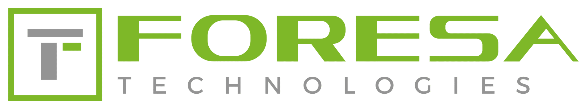
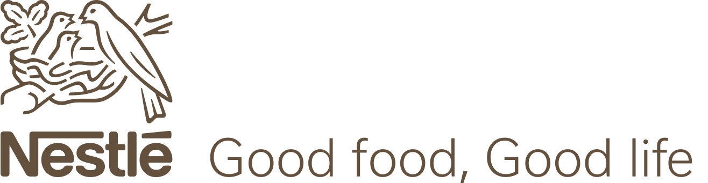

### Hola, mi nombre es Lázaro Guillermo Pérez Montoto

Soy un apasionado de la programación. Tuve mis comienzos de forma autodidacta con Python y luego me formé como:

- ***Técnico Superior:** Desarrollo de Aplicaciones Multiplataforma (**DAM**). IES San Clemente. Santiago de Compostela (20/12/21)*

- ***Certificado de Profesionalidad Nivel 3:** Desarrollo de aplicaciones con **tecnologías web** (Código: IFCD0210)*

Actualmente soy el responsable SAT en Atlas Romero S.L.U. encargado de mantenimiento y verificación de equipos propios de clientes:

  <!-- Köttermann -->
  
  
  <!-- Bayer Hispania -->
  
  
  <!-- Foresa -->
  
  
  <!-- Nestlé Pontecesures -->
  

  
  
  
  

| Köttermann | Bayer Hispania | Foresa | Nestlé Pontecesures |
| :---: | :---: | :---: | :---: |
| <td bgcolor="#ffffff" align="center" valign="middle"></td> | <td bgcolor="#ffffff" align="center" valign="middle"></td> | <td bgcolor="#ffffff" align="center" valign="middle"></td> | <td bgcolor="#ffffff" align="center" valign="middle"></td> |

